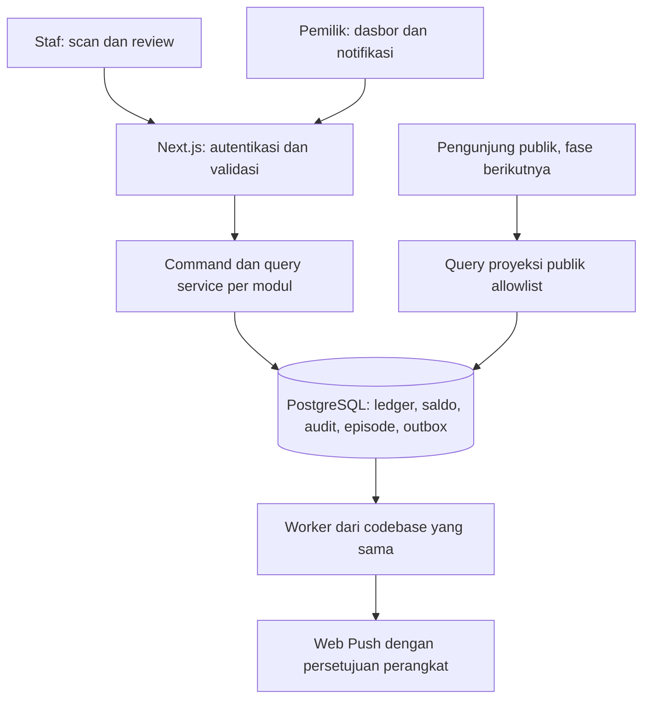

# 02 — Arsitektur teknis

Status: desain target, belum diimplementasikan. Arah teknologi tetap mengikuti brief; keputusan rinci dan alternatif dicatat di [10](10-DECISIONS.md).

## Bentuk sistem

Satu modular monolith, satu repositori, satu PostgreSQL. Next.js menyajikan UI dan endpoint; proses worker dari codebase/image yang sama menangani outbox dan pekerjaan berkala. Worker bukan layanan domain terpisah. Tidak ada Redis, Kafka, Elasticsearch, atau backend terkelola sebagai prasyarat.



| Modul | Memiliki | Dependensi yang diperbolehkan |
| --- | --- | --- |
| identity | Akun, sesi, peran, pemeriksaan izin | Infrastruktur DB/auth |
| products | Master, kategori/brand, identitas produk | identity, audit; identitas barcode melalui kontrak barcode |
| inventory | Command stok, ledger, saldo, posisi serial | products, identity, audit, evaluasi stock-health |
| barcode | Registry kode, resolusi, label | products, identitas item; tidak mengubah saldo |
| stock-health | Kebijakan minimum, state dan episode | Saldo yang disuplai dalam transaksi inventory; bukan query HTTP silang |
| notifications | Inbox, outbox, subscription, delivery | identity, event stock-health; tidak menulis ledger |
| audit | Catatan peristiwa immutable dan pembacaan berizin | Infrastruktur; tidak memanggil modul bisnis kembali |
| operations | Backup status, health, rekonsiliasi | Query terbatas, worker |
| public-catalog / sales | Proyeksi publik / RFQ dan penjualan mendatang | Kontrak produk dan inventory; tanpa tulis tabel stok langsung |

Domain service menerima konteks actor dan transaksi eksplisit. Modul lain menggunakan interface layanan, bukan mengubah tabel milik modul secara bebas. Evaluasi stok dan pembuatan event berada dalam **transaksi yang sama** dengan posting; pengiriman jaringan dilakukan setelah commit oleh worker.

## Rencana struktur kode — belum dibuat

```text
src/app/                 route publik, auth, dan aplikasi internal
src/modules/<module>/    domain, application, repository, schemas, UI modul
src/server/              DB, auth adapter, konfigurasi tervalidasi
src/shared/              tipe, pemetaan pesan Indonesia, utilitas kecil
src/workers/             polling outbox dan job terjadwal
drizzle/                 migrasi ditinjau, kelak
tests/                   unit, integration, concurrency, e2e
prototypes/              HTML/CSS terisolasi dan catatan review
docs/                    kontrak dan pelacak resmi
```

Jangan membuat folder kode kosong sekadar meniru diagram. Paket dan versi stabil yang kompatibel diverifikasi pada P01, lalu lockfile dikomit. Hindari kode yang hanya mengantisipasi fase mendatang.

## Batas transport dan layanan

Gunakan Route Handler untuk command inventaris dan status retry; Server Component/Action boleh menjadi adapter tipis untuk UI lain. Semua jalur memanggil command/query service yang sama dengan Zod, autentikasi, izin dan batas objek. Server Action tetap diperlakukan sebagai endpoint yang dapat diserang. [Panduan Next.js](https://nextjs.org/docs/app/guides/authentication) mendukung pemeriksaan izin dekat akses data; pemilihan struktur di atas adalah keputusan LATANSA.

Kontrak command stok, belum berupa implementasi:

| Bagian | Kontrak |
| --- | --- |
| Permintaan | `idempotencyKey`, `sourceSessionId`, `type`, sumber/tujuan bila relevan, `lines`, alasan terstruktur, referensi opsional, waktu dokumen opsional |
| Baris | `productId`, `quantity` sebagai string desimal kanonis, `serializedItemId` bila item sudah ada, metadata penerimaan serial baru bila relevan |
| Identitas tepercaya | `actorId`, izin, waktu posting, saldo, status, delta dan audit dibentuk server; tidak menerima klaim browser |
| Sukses | ID/nomor transaksi, `postedAt`, ringkasan hasil dan versi saldo; hanya dikembalikan setelah commit |
| Galat | `code` internal stabil, `message` Indonesia, `fieldErrors` bila ada, `requestId`, `retryable`; tanpa SQL/stack/secret |
| Retry | Payload identik + key yang sama. Status receipt hanya dapat dibaca pemilik sesi atau pemilik berizin |

Endpoint konseptual: `POST /api/inventory/commands`, `GET /api/inventory/commands/status?key=…`, `POST /api/barcodes/resolve`, `GET /api/inventory/balances`, `GET /api/notifications`. Nama boleh disesuaikan sebelum implementasi bila semantik tidak berubah; endpoint bukan jaminan telah tersedia.

HTTP: 401 belum masuk, 403 tidak berizin, 404 objek tak boleh diketahui/tidak ada, 409 konflik stok/serial/key, 422 input, 429 terlalu sering, 503 gangguan sementara. Hilangnya respons tidak membuktikan transaksi gagal; semantik pastinya di [06](06-INVENTORY-SPEC.md).

## Pembacaan dan konsistensi

- Ledger append-only adalah otoritas; tabel saldo adalah proyeksi yang diperbarui sinkron dalam commit yang sama. Jangan memakai materialized view yang terlambat untuk validasi pengeluaran.
- Gunakan primary DB untuk query stok setelah posting. Tidak ada read replica pada MVP.
- Ringkasan dasbor menggunakan satu snapshot read-only `REPEATABLE READ` atau satu query atomik agar kartu yang berkaitan konsisten; tampilkan waktu snapshot. Pagination riwayat menggunakan `(posted_at, id)` stabil.
- Response internal dan auth `no-store`; tidak masuk cache publik, CDN, localStorage, atau service worker. PWA hanya menyimpan aset shell yang tidak sensitif. Draft sementara per tab dijelaskan [12](12-BARCODE-SCANNER.md).
- `timestamptz`/instant UTC untuk kejadian, IANA `Asia/Jakarta` untuk tanggal bisnis. Rentang hari adalah tengah malam WIB inklusif sampai tengah malam berikutnya eksklusif, dikonversi ke UTC di server. `documentDate` tidak mengubah urutan ledger.
- Semua angka stok menggunakan desimal eksak; JSON mengangkut string. Tidak ada float untuk perhitungan domain.

## Proyeksi publik dan file

Master tunggal tidak berarti response tunggal. Query publik hanya mengambil produk `PUBLISHED` dan aktif, dengan allowlist: ID publik/slug, SKU publik bila disetujui, nama, kategori/brand publik, deskripsi yang disanitasi, spesifikasi publik, gambar publik, dan metadata SEO. MVP tidak memiliki route publik produk.

Harga beli, margin, pemasok, lokasi, jumlah tepat, serial, catatan privat, audit dan identitas pengguna dilarang. Bahkan Boolean ketersediaan publik ditunda sampai kebijakan publikasi disepakati; default tampilkan “Hubungi kami untuk ketersediaan”. Jangan `SELECT *` lalu menyembunyikan field di komponen. Proyeksi adalah query/view allowlist, bukan database produk kedua. Bila memakai DB role publik pada fase website, role hanya dapat membaca view aman.

Gambar publik dan lampiran privat menggunakan penyimpanan terpisah secara akses. MVP tidak membutuhkan lampiran operasional. Fase upload: validasi ukuran/MIME/signature, nama objek acak, tidak mengeksekusi SVG/HTML tak tepercaya, akses privat melalui handler berizin. Public image tidak boleh berisi label serial atau dokumen gudang nyata.

## Ketahanan dan skala awal

Proses DB singkat, tanpa input manusia atau HTTP eksternal saat lock ditahan. Worker mengklaim outbox dengan lease; kegagalan provider tidak membatalkan stok. Protokol retry, batas waktu, dan locking dimiliki [06](06-INVENTORY-SPEC.md) dan [13](13-NOTIFICATIONS.md).

DB role runtime bukan schema owner/superuser; tidak diberi UPDATE/DELETE/TRUNCATE pada ledger/audit. Migrator terpisah. Constraint dan kontrol command menjaga integritas; akun DB runtime yang bocor tetap merupakan insiden besar, bukan ancaman yang dapat diselesaikan oleh pemisahan modul saja.

Angka kapasitas awal untuk pengujian, bukan data bisnis: 5.000 SKU, 20.000 item serial, 100.000 baris ledger, dua operator aktif. Indeks mengikuti unique key, `(product_id, location_id)`, waktu posting, actor, status notifikasi dan outbox due. Ukur dahulu sebelum menambah infrastruktur.
