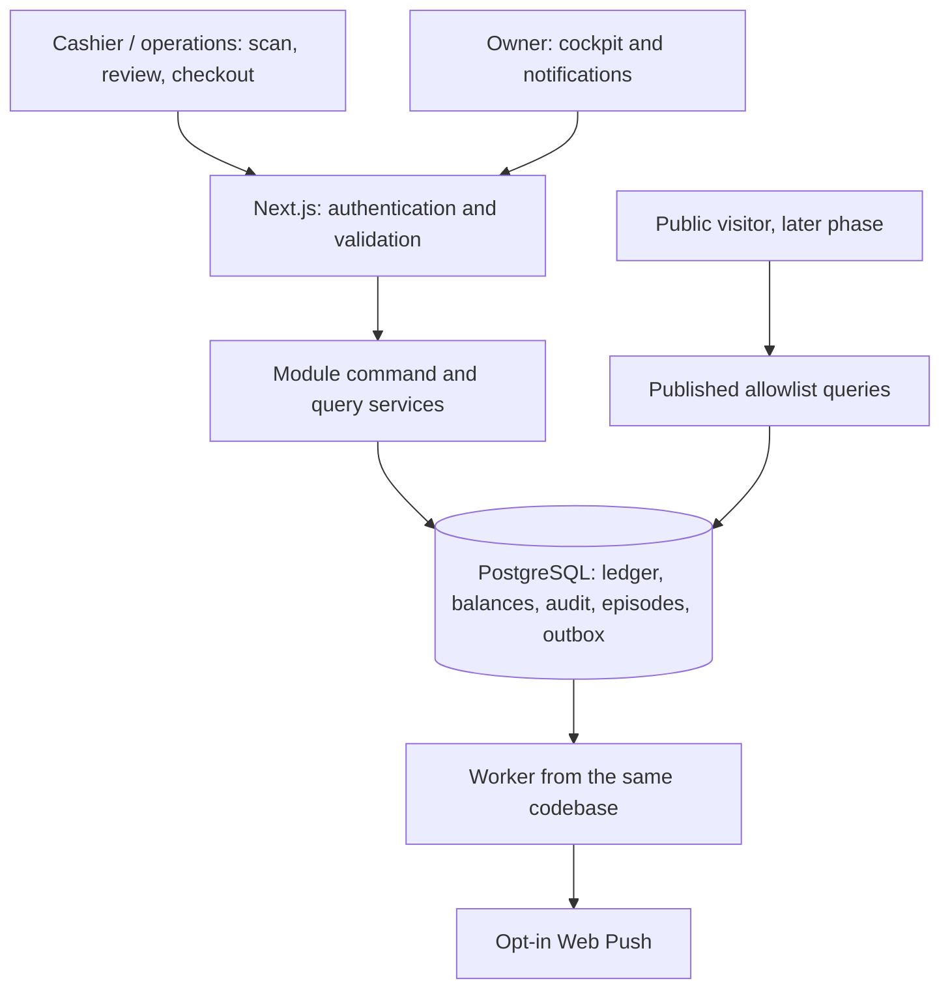

# 02 — Technical architecture

Target design only. Historical standalone CP01 exists; no production application exists. Plan 3.0 puts retail POS and truthful finance in Core. [10](10-DECISIONS.md) records choices and alternatives.

## System shape

One modular monolith, repository and PostgreSQL database. Next.js serves UI and endpoints. A worker from the same codebase/image handles outbox delivery and scheduled work. No Redis, Kafka, RabbitMQ, Elasticsearch, Kubernetes or managed backend is required.



| Module | Owns | Allowed dependencies |
| --- | --- | --- |
| identity | Accounts, sessions, roles, authorization | Database/auth infrastructure |
| products | Master, category/brand/unit, product identity | identity, audit, barcode contract |
| inventory | Stock commands, ledger, balances, serial positions | products, identity, audit, stock-health |
| barcode | Registry, resolution and labels | products/item identity; no balance writes |
| stock-health | Threshold evaluation, state and episodes | Balances supplied inside inventory transactions |
| notifications | Inbox, outbox, subscriptions and delivery | identity, stock-health events; no ledger writes |
| audit | Immutable events and authorized reads | Infrastructure; no calls back into business modules |
| operations | Health, backup status and reconciliation | Restricted queries and worker |
| imports (Core) | Private staging, validation, preview, jobs/results | Product identity or OPENING commands under 14 |
| finance | Core evidence, goods MWA, service costs and versioned gross reports | Read-only physical/commercial facts under 15 |
| business-config | Single business identity, receipt/policy revisions and registers | identity, audit, validated storage |
| sales | Core carts, checkout, payments, receipts, returns/refunds and shifts | inventory in the SAME transaction, products, identity, audit; 17 |
| commercial (later) | RFQ, leads, quotation and deferred fulfillment | sales/finance contracts; no duplicate sale ledger |
| public-content (later) | Structured company content, settings, revisions, publishing | identity, audit, validated media |
| public-catalog (later) | Published product projections and queries | products, public-content |
| sales (later) | RFQ, leads, quotation, fulfillment and revenue facts | Product/inventory contracts; no direct stock writes |

Services receive explicit actor and transaction context. Other modules call service interfaces rather than writing foreign tables. Stock-health, inbox/event/outbox and audit commit with stock. External delivery occurs after commit.

## Planned code structure

```text
src/app/                 public, auth and internal routes
src/modules/<module>/    domain, application, repository, schemas, module UI
src/server/              database, auth adapter, validated configuration
src/shared/              types, Indonesian message mappings, small utilities
src/workers/             outbox polling and scheduled jobs
drizzle/                 reviewed migrations, later
tests/                   unit, integration, concurrency and E2E
prototypes/              isolated HTML/CSS and review records
docs/                    canonical specifications and tracker
```

Do not create empty code directories just to match this diagram. Verify stable compatible packages and advisories at R02.1, then lock versions.

## Transport and service boundary

Use Route Handlers for inventory commands and recovery status. Server Components/Actions may be thin adapters elsewhere. All adapters use the same Zod validation, authentication, permission and object-boundary checks. Server Actions are externally callable attack surfaces. Check authorization near data access; see [Next.js authentication guidance](https://nextjs.org/docs/app/guides/authentication).

| Stock command part | Contract |
| --- | --- |
| Request | idempotencyKey, sourceSessionId, type, relevant locations, lines, structured reason, optional reference/document date |
| Line | productId, canonical decimal quantity string, existing serializedItemId or new receipt identity metadata |
| Server authority | Actor, permissions, posting time, balances, status, signed deltas and audit |
| Success | Movement ID/number, postedAt, result summary and balance versions, only after commit |
| Error | Stable code, Indonesian message, fieldErrors where applicable, requestId, retryable; no SQL/stack/secrets |
| Retry | Identical envelope and key; receipt access restricted to session actor or authorized owner |

Conceptual endpoints: POST /api/inventory/commands; GET /api/inventory/commands/status?key=…; POST /api/barcodes/resolve; GET /api/inventory/balances; GET /api/notifications. These are proposed contracts, not existing endpoints.

HTTP semantics: 401 unauthenticated, 403 denied, 404 nonexistent/undisclosable, 409 state/key conflict, 422 invalid input, 429 rate limit, 503 temporary failure. Missing responses never prove rollback; [06](06-INVENTORY-SPEC.md) owns recovery.

## Reads, time and consistency

- Ledger is authoritative. Balance projections update synchronously in the same commit. Never use stale materialized views to authorize stock issues.
- Use the primary database for post-command reads. No MVP read replica.
- Related dashboard values share one atomic query or read-only REPEATABLE READ snapshot. Include snapshot time. History pagination uses stable (posted_at, id).
- Internal/auth responses are no-store and excluded from public caches and service-worker data caching. Only nonsensitive shell assets may be cached. [12](12-BARCODE-SCANNER.md) defines temporary tab drafts.
- Events use UTC timestamptz. Business dates use Asia/Jakarta. Day ranges are local midnight inclusive to next midnight exclusive, converted server-side. documentDate never changes physical posting order.
- Domain quantities use exact decimals and JSON strings, never floating-point arithmetic.

## Public projections

Query only active, published products. Allowlist public ID/slug, approved public SKU, name, public category/brand, sanitized description, public specifications/images and SEO. No public product route is part of Core.

Exclude costs, COGS, margins/profit, supplier-sensitive data, exact quantity/location, serials, private notes, audit and user/security data. Public availability indicators require a later explicit policy; default UI: **Hubungi kami untuk ketersediaan**. Never SELECT * and hide fields in components. A separate public DB role, if added, reads safe views only.

Product publication is a revisioned projection of the same master. Editing a draft does not leak to the live site. Keep the published content snapshot stable until republished; live master deactivation always hides the product for safety. Stock and private fields never enter a publication snapshot.

## Lightweight first-party CMS and wa.me

Implement in R09, after Core. Use typed database fields and constrained sections, not arbitrary page-builder blocks or raw HTML/scripts/CSS. Own company display name/tagline, hero title/text/media, About, address/office hours, public contacts, section headings/copy, footer, SEO and featured product references. Product content remains in the product domain. Public RFQ/contact copy and WhatsApp default/product/RFQ templates are editable settings.

Workflow: **DRAFT → authenticated PREVIEW → PUBLISH**. The owner alone can edit site settings and publish company/product content. Operations admins may prepare authorized product drafts; they cannot publish or manage site-wide content. Publishing validates required fields, safe links/media, active featured product references and the expected revision. Concurrent stale publication fails rather than overwriting.

Store immutable published revisions, actor/time and a safe audit diff. Publish pointer and audit commit atomically. Rollback republishes a previous valid revision as a new action. Never erase publication history. Preview is owner-authenticated, no-store and noindex, with no public bearer preview URLs.

Published settings are read dynamically from PostgreSQL. Initial low-traffic public reads use no-store; static assets may be cached by immutable name. Routine edits therefore need no build/redeploy. If public query caching is later measured as necessary, use revision-keyed cache with reliable publish invalidation and tests for stale/cross-boundary data.

WhatsApp uses standard `https://wa.me/<international-digits>?text=<encoded-text>` links, following the [official click-to-chat format](https://faq.whatsapp.com/5913398998672934). Validate the international number; remove formatting and reject invalid destinations. It is business content, not a source-code constant or deployment secret. Allowlisted template placeholders: public product name/SKU/URL and, later, an authorized public RFQ reference. Do not insert private prices, serials, notes or customer PII into public templates. Encode text once and construct the destination from a fixed wa.me origin; never accept an arbitrary redirect URL.

Use the currently published number/template. Preview labels are clear and do not generate real tracking. An optional first-party outbound click event records CTA type, public product/reference, timestamp and minimal source context, then redirects. Tracking failure must not block the link. Do not record message body or interpret the click as delivery, conversation, lead qualification or sale. No WhatsApp Business API, Meta Cloud API, webhook provider or paid messaging SaaS.

## Storage and scale

Use configurable VPS/local storage initially. A storage adapter accepts object keys rather than hardcoded absolute paths. Separate private staging/media from deliberately published assets; no private directory is web-served. [09](09-DEPLOYMENT-OPS.md) owns configuration, limits, permissions, backup/restore and future S3 migration.

Bulk import staging and validated business logo storage are Core; product images are later. Parser work is resource-limited and outside long Next.js requests. Metadata/rows/results live in PostgreSQL. One apply job per company; staging is batched, final business apply is atomic under 14. Separate execution slots for import and notifications prevent a large parse blocking push delivery. This remains one codebase, without external queue infrastructure.

Stock import calls the same command service with the authorized opening-import limit; interactive commands remain limited to 200 lines. Every master mutator shares normalization and permission rules. Job/file/error access is authorized, same-origin and no-store.

Search, filters, sorting and pagination are server-side. Exact indexed SKU/barcode lookup first; evaluate PostgreSQL full-text/trigram only when required by measured queries. Whitelist sorts and use ID tie-breakers. Maximum page size 100; selector at most 20 candidates. Never fetch the whole master for a browser table or selector.

Initial benchmark only: 5,000 SKUs, 20,000 serials, 100,000 ledger legs and two active operators. Index unique identities, product/location, posting time, notification recipient/state and due jobs. Validate query plans before adding indexes or infrastructure.

Runtime DB role is not schema owner/superuser and has no UPDATE/DELETE/TRUNCATE on ledger/audit. Migrator is separate. Transactions hold no human input or external network calls.

Cost evidence is private, absent from stock/product DTOs. Core records a per-product posting sequence. Core finance reads physical facts/evidence/revenue into versioned valuations and checks completeness before displaying profit. A delayed valuation cannot invalidate a successful stock posting or silently rewrite published financial results.

## Core business configuration and commercial boundary

Single deployment/database owns one BusinessProfile, not a tenant service. Owner edits typed identity fields, previews neutral accessible theme/receipt and activates a revision with optimistic concurrency and audit. Receipt snapshots retain the selected identity/logo/template revision forever. Brand changes require no redeploy; operational origin/secrets remain deployment configuration. Tax/payment policy is separately versioned and cannot be inferred from decorative brand settings.

Core stack remains Next.js/TypeScript, PostgreSQL, Drizzle, Zod, Tailwind, selectively composed shadcn/ui, Lucide, Better Auth, Vitest and Playwright. 09 owns cost/license audit. No packages are installed here.

17 owns sale/shift endpoints and recovery: cart create/update, checkout/status, sale/document reads, refund/return, shift open/count/close. All adapters call shared application services with server actor, validated scope and one transaction context. Checkout composes inventory instead of dispatching asynchronous stock jobs. Stock audit/attention and commercial/payment/shift/document facts commit together. Printing/push and valuation are recoverable post-commit work; service-only sales create no movement. Current finance uses consistent revenue/cost watermarks and completeness, never stale values pretending to cover newer sales.

Private routes/documents are authenticated/no-store; service worker caches only nonsensitive shell assets. Barcode search returns authorized sale price and availability to cashier, not costs or broad warehouse history. Cashier server drafts are actor-scoped; sessionStorage is only a recoverable local view, never the durable sale. Brand-neutral receipts use validated local assets and browser print/PDF, no paid rendering service.
