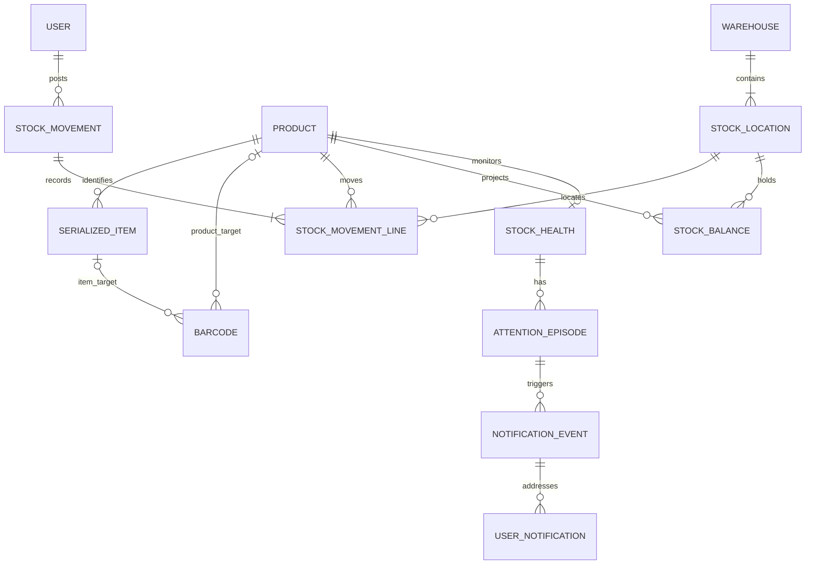

# 03 — Conceptual domain model

These entities are business contracts, not migrations or a requirement to create every table now. **M** = Core MVP; **L** = later. [06](06-INVENTORY-SPEC.md) owns stock rules; [12](12-BARCODE-SCANNER.md) code identity; [13](13-NOTIFICATIONS.md) attention episodes.

## Aggregates

StockMovement is an atomic posted document. StockMovementLine is a signed product/location ledger leg. Transfer has outgoing and incoming legs. ScanSession is an interaction draft, never a balance source. Balances, item positions and health are synchronous, reconcilable projections.

## Identity and product domain

| Entity / stage | Identity and relationships | Lifecycle, mutability and audit |
| --- | --- | --- |
| User (M) | Individual person; unique normalized login email; roles and sessions | INVITED → ACTIVE → DISABLED. Reissue expired invitations. Never delete historical actors. Role/disable/reset changes audited; revoke sessions |
| Role / Permission (M) | Three fixed roles; permissions defined in code; unique user-role assignment | Owner manages assignments; retain grant/revoke history. No dynamic role builder |
| AuthSession (M) | Library-managed session, user and expiry | Revocable/expiring; secrets never logged; operational retention separate from business history |
| Product (M) | One master; permanently unique normalized SKU, trackingMode, unit/precision, minimum, version | Active state separate from later DRAFT/PUBLISHED/ARCHIVED content. Version-check mutable content. SKU/tracking/unit/precision lock after first ledger use. Deactivate only with zero balances and no reservations/open operations |
| Category / Brand (M) | Unique normalized reference code/slug | Audited rename/deactivation; referenced values not deleted. No complex category tree |
| Unit (M) | Unique code, precision 0–3 | Ledger-used unit/precision cannot change. Inactivation blocks new selection, preserves history; product carries stable reference/snapshot |
| ProductImage (L) | Product asset metadata, order, alt text, unique object key | Private until validated/published. Physical removal only when unreferenced and retention permits |
| ProductSpecification (L) | Unique key per product; typed value/unit/public visibility | Validated, explicitly publishable, audited edits |
| Barcode (M) | Globally unique normalized token; exactly one product OR item target; multiple aliases possible | ACTIVE/RETIRED. Never reuse or reassign a retired token; audit retirement/reprint |

A manufacturer barcode shared by a model targets the product. Manufacturer serial is an item attribute; internal identity remains authoritative. Serial lookup requires product context when numbers are not globally unique.

## Warehouse and stock

| Entity / stage | Identity and relationships | Lifecycle, mutability and audit |
| --- | --- | --- |
| Warehouse (M) | Physical site, permanent unique code, at least one location | Active/inactive; cannot deactivate with stock/open operations |
| StockLocation (M) | Code unique within warehouse; STORAGE in Core | Parent warehouse immutable after use. QUARANTINE/TRANSIT later. Deactivate only with zero stock/reservations and no open serial/transfer operations |
| StockMovement (M) | Type, actor, postedAt, reason/reference, source session, receipt | POSTED only; drafts elsewhere. Immutable, no soft deletion. Reversal relation supplies the displayed reversed state |
| StockMovementLine (M) | Signed delta, product/location, optional item, unit/SKU snapshot, before/after balance, inventorySequence | Nonzero delta; unique movement/lineNo; immutable, RESTRICT foreign keys. Serial transfer has two legs; unique movement/serial/leg |
| StockBalance (M) | One product/location; onHand, reserved, version | Unique pair. Zero rows may be created during posting. No edit endpoint; reserved is zero before reservation module |
| CommandReceipt (M) | Actor, key, sourceSession, fingerprint version/hash, movement, safe result | Unique actor/key and actor/sourceSession. Same commit as movement. Permanent, no upload-style TTL |
| SerializedItem (M) | Unique internal ID/barcode; optional manufacturer serial; product, position, lastLineId/version | REGISTERED → IN_STOCK → ISSUED; verified return may restore IN_STOCK. REGISTERED adds no stock. Only on-hand items have location. Never reuse/delete identity; audited owner metadata correction |
| Transfer (M direct; L staged) | Direct transfer needs only movement header/legs | Direct commit/rollback together. Later DRAFT → DISPATCHED → PARTIALLY_RECEIVED → RECEIVED; cancel only before dispatch; link dispatch/receipt |
| Adjustment (M minimum) | Count difference, reason/reference, ADJUSTMENT movement | Owner executes in Core. Later staff proposal via Approval. Never overwrite historical correction |
| InventoryReservation (L) | Product/location, source deal/reference, optional specific serial allocation | ACTIVE → FULFILLED/RELEASED/EXPIRED; partial fulfillment remains active until remaining zero. Immutable quantity events, unique active serial allocation |
| StockOpname (L) | Frozen location scope, baseline, counts, differences, final adjustment | DRAFT → COUNTING → SUBMITTED → APPROVED → POSTED, or CANCELLED before posting. Submitted count immutable; recount creates revision |

Later serial states: QUARANTINED, IN_TRANSIT, IN_SERVICE, RETIRED. On-hand ownership and physical location must remain ledger-consistent. Customer-owned service items are not company stock. [06](06-INVENTORY-SPEC.md) governs these extensions.

## Monitoring, service and sales

| Entity / stage | Identity and relationships | Lifecycle and audit |
| --- | --- | --- |
| StockHealth (M) | One product, state/version, optional active episode; policy stays on Product | NORMAL/LOW/OUT when monitored; null otherwise. Update under product guard; no duplicated threshold policy |
| AttentionEpisode (M) | Unique sequence per product, at most one open | OPEN → RESOLVED; record recovery/policy/monitor-off reason. Read status never closes it |
| NotificationEvent (M) | Immutable episode fact and safe snapshot | Unique episode/severity for LOW/OUT; retain business fact |
| UserNotification (M) | Event-recipient inbox entry | Unique event/user; mutable readAt does not affect stock |
| Outbox / Delivery (M) | Event/channel/recipient/device work and attempts | PENDING/IN_FLIGHT/DELIVERED/RETRY/DEAD/SUPPRESSED; unique keys and leases; append-only attempts; no exactly-once delivery claim |
| PushSubscription (M) | Sensitive endpoint/keys, owner user, unique endpoint hash | Active/revoked/expired; logout/disable detaches device |
| AuditEvent (M) | Actor/service actor, action/entity, request, reason, filtered before/after | Append-only, schema version/server time. Successful business audit shares its transaction; denied access logged separately |
| Approval (L) | Proposal hash/version, requester/approver, expiry | PENDING → APPROVED/REJECTED/EXPIRED; APPROVED → CONSUMED once. Changed proposal invalidates approval; no staff self-approval |
| QCRecord (L) | Inspection, item, result, inspector | Draft editable, final immutable; corrections create records. Failed QC uses inventory transfer to quarantine |
| Warranty (L) | Serial coverage period/terms/provider | Draft/active/expired/void, audited changes; no stock ownership mutation |
| ServiceCase (L) | Unit, ownership, complaint/work/result | Open/in progress/closed/cancelled; append-only activity. Inventory command only for real company-stock movement |
| RFQ / RFQLine (L) | Public request, private contact and requirements snapshot; optional product | New/qualified/closed/spam; limited/rate-limited intake. Not an order/reservation |
| Lead (L) | Manual/RFQ sales follow-up | Open/qualified/won/lost; audited activity; merging duplicates preserves references |
| Quotation / Deal (L) | Versioned terms, product and quantity agreement | Final quotation immutable per version. Accepted deal may reserve, never directly reduce onHand |

## Import and finance

| Entity / stage | Identity and relationships | Lifecycle and audit |
| --- | --- | --- |
| ImportJob / ImportRow (M) | Typed private product/quantity opening/serial opening staging; file hash, parser/template revision, preparer, row provenance | [14](14-BULK-IMPORT.md) owns states. Staging is not master/stock; transient file retention under 09; successful normalized manifest retained |
| ImportCommit (M) | Unique job/revision, executor, fingerprint/result; opening links one receipt/movement | Immutable, same business transaction, no upload TTL |
| OnboardingFreeze (M) | Count/cutover reference, location scope, actor/start/end; one active freeze per location | Owner releases after reconciliation. No database transaction held during counting; full opname remains later |
| AcquisitionCostEvidence (M) | Receipt/opening line or serial source, currency, actual amount, provenance, completeness/revision | MISSING/DRAFT/VERIFIED/superseded revisions, owner-only audit. Never changes quantity |
| SalesFulfillment / RevenueEvent (L) | Issue allocation, acceptance/credit note, quantity, net amount, recognizedAt/recordedAt | Unique source allocation/revision. Final events immutable; corrections are linked events. WON is not revenue |
| ValuationRun / CostEvent (L) | Policy/evidence version, source sequence/watermark, product cost pool | Unique run/source/event. PENDING/BLOCKED/READY/PUBLISHED/SUPERSEDED; atomic publication, no physical-ledger rewrite |
| CostAllocation / DispatchClearing (L) | Issue quantity/value, matched acceptance/return and residual book cost | Cumulative allocation cannot exceed issue. Pending acceptance is not COGS. Corrections/report lineage versioned |
| FinancialReportSnapshot (L) | Scope/period, valuation/revenue version, completeness and calculatedAt | Published immutable; revised version preserves original; owner-only export |

Costing eligibility is separate from QUANTITY/SERIALIZED. [15](15-FINANCE-PROFITABILITY.md) owns formulas and recognition rules.

## Public content and settings (later)

| Entity | Contract |
| --- | --- |
| SiteContentRevision | Structured company/hero/About/contact/hours/section/footer/SEO fields and validated asset references; DRAFT revision editable with optimistic version; published revision immutable |
| PublicSettingsRevision | WhatsApp international number and allowlisted default/product/RFQ templates, inquiry copy; same draft/preview/publish lifecycle; no secret credentials |
| ProductPublicationRevision | Snapshot of allowlisted public product content/specifications/images/SEO; belongs to the existing Product, not a second master |
| PublicationRecord | Published pointer/revision, actor/time, action and safe audit reference; publication and audit atomic; rollback is a new publication |
| OutboundClickEvent | Optional first-party CTA/public product/reference/time/source event; no message body or conversation/sale outcome |

Only SUPER_ADMIN manages site-wide content/settings and publishes. Public reads resolve published revisions only; inactive products stay hidden even if a snapshot exists. [02](02-ARCHITECTURE.md) owns publishing/cache semantics.

## Cross-entity constraints

- Opaque server-generated IDs; human document numbers are not primary keys. Rollback gaps are acceptable.
- Critical business foreign keys use RESTRICT, never cascade-delete history from user/product/location.
- Preserve raw identity display and explicit normalized values. Uniqueness is enforced in the database; deactivation does not free a SKU/barcode.
- Quantity is exact numeric(18,3), product precision 0–3, serial precision zero. Reject excess precision rather than rounding.
- onHand ≥ 0 and 0 ≤ reserved ≤ onHand; reserved projection equals active remaining reservations.
- Serial legs explain zero or one physical unit and agree with status/location. Item and ledger product must match through composite foreign key/database validation.
- Local rules use UNIQUE/CHECK/FK. Cross-row consistency uses transactions, guard locks and deferred posting validation. Do not use CHECK to read other tables; see [PostgreSQL constraints](https://www.postgresql.org/docs/current/ddl-constraints.html).
- Master/content edits require optimistic version checks. Reject stale updates.
- [09](09-DEPLOYMENT-OPS.md) owns retention. Demo data is isolated; no fixed-password seeded accounts.
