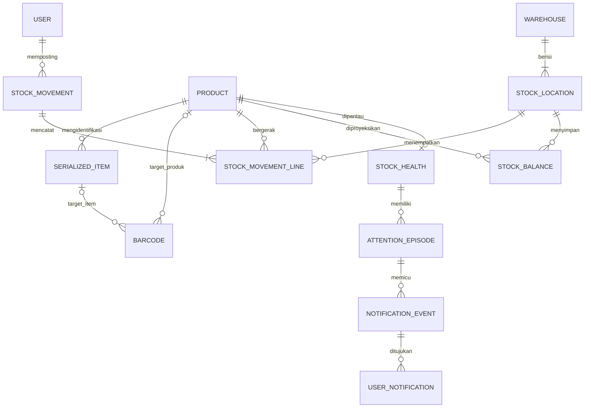

# 03 — Model domain konseptual

Entitas berikut adalah kontrak bisnis, bukan migrasi atau kewajiban membuat semua tabel sekarang. **M** = Core MVP, **L** = lanjutan. Detail perhitungan ada di [06](06-INVENTORY-SPEC.md); kode/scan di [12](12-BARCODE-SCANNER.md); episode/peringatan di [13](13-NOTIFICATIONS.md).

## Agregat dan relasi

`StockMovement` adalah dokumen posting atomik. `StockMovementLine` adalah kaki ledger bertanda per produk/lokasi; satu transaksi transfer memiliki kaki keluar dan masuk. `ScanSession` hanyalah draf interaksi dan bukan sumber saldo. `StockBalance`/posisi item/health adalah proyeksi sinkron yang dapat diverifikasi ulang dari sumber masing-masing.

## Identitas dan katalog

| Entitas / tahap | Tanggung jawab, relasi, keunikan | Siklus hidup, mutabilitas, penghapusan dan audit |
| --- | --- | --- |
| User (M) | Manusia individual; banyak role assignment dan session; email login normalisasi unik | `INVITED → ACTIVE → DISABLED`; undangan kedaluwarsa dapat diterbitkan ulang. Tidak menghapus actor bersejarah. Ganti peran/nonaktif/reset diaudit dan mencabut sesi |
| Role / Permission (M) | Tiga role tetap, permission tetap di kode, assignment unik user-role | Tidak ada pembuat role dinamis MVP. Assignment hanya owner; riwayat pemberian/pencabutan disimpan |
| Auth Session (M) | Sesi library terhubung user dan masa berlaku | Dapat dicabut/kedaluwarsa; token rahasia tidak masuk log/audit. Retensi berbeda dari catatan bisnis |
| Product (M) | Satu master untuk stok dan kelak katalog; SKU normalisasi unik permanen; `trackingMode`, satuan dasar, precision, minimum, version | Aktif/nonaktif terpisah dari `DRAFT/PUBLISHED/ARCHIVED` publikasi kelak. Nama/deskripsi bisa diubah dengan version check. SKU, tracking mode, satuan/precision terkunci setelah ledger pertama. Nonaktif hanya bila saldo nol dan tanpa reservasi/operasi terbuka; riwayat tetap dapat dibaca |
| Category / Brand (M minimal) | Klasifikasi produk; kode/slug normalisasi unik | Aktif/nonaktif, rename diaudit; yang direferensikan tidak dihapus. Jangan membuat pohon kategori kompleks MVP |
| ProductImage (L) | Metadata aset milik produk, urutan/alt text; objek storage unik | Privat dahulu, publik setelah validasi/publikasi; hapus fisik hanya setelah kebijakan retensi/backup dan tak direferensikan |
| ProductSpecification (L) | Pasangan spesifikasi terstruktur produk untuk katalog/comparison | Key unik per produk; nilai/tampilan dan satuan tervalidasi, visibility publik eksplisit; edit diaudit |
| Barcode (M) | Registry token normalisasi global; tepat satu target produk **atau** item; banyak alias per target | `ACTIVE/RETIRED`; token tidak digunakan ulang atau dipindah ke target lain. Penonaktifan dan cetak ulang diaudit. Aturan namespace ada di 12 |

Barcode produsen yang dipakai semua unit suatu model menunjuk **produk**, bukan satu serial. Nomor seri produsen merupakan atribut item; keunikan item tetap menggunakan identitas internal. Pencarian serial harus disertai produk bila nomor seri tidak unik lintas produk.

## Gudang dan akuntansi

| Entitas / tahap | Tanggung jawab, relasi, keunikan | Siklus hidup, mutabilitas, penghapusan dan audit |
| --- | --- | --- |
| Warehouse (M) | Situs fisik; kode unik permanen; memiliki ≥1 lokasi | Aktif/nonaktif, tidak dipindah identitasnya. Tidak dapat nonaktif selama lokasi menyimpan stok/operasi terbuka |
| StockLocation (M) | Lokasi saldo; kode unik dalam gudang; tipe `STORAGE` pada MVP | Aktif/nonaktif; gudang induk immutable setelah digunakan. Lokasi `QUARANTINE/TRANSIT` ditambah fase terkait. Nonaktif hanya saldo/reservasi nol, tanpa serial/transfer terbuka. Audit perubahan |
| StockMovement (M) | Header dokumen, type, actor, postedAt, reason, reference, sourceSession, idempotency | Hanya `POSTED`; draf berada di sesi/permintaan terpisah. Immutable setelah commit; tidak soft-delete. Relasi pembalikan menentukan tampilan “Dibalik”, bukan mengedit header asli |
| StockMovementLine (M) | Kaki signed delta, product, location, item opsional, unit/SKU snapshot, saldo sebelum/sesudah | Delta nonzero; unik `(movement, lineNo)`; immutable, FK `RESTRICT`. Transfer serial memiliki dua kaki; unique `(movement, serial, leg)` mencegah kaki ganda |
| StockBalance (M) | Proyeksi satu produk × lokasi: onHand, reserved, version | Unique `(product, location)`; zero row boleh dibuat saat posting. Tidak ada endpoint edit. Reserved = 0 sebelum fitur reservasi. Rebuild hanya prosedur rekonsiliasi berizin; tidak mengubah fakta ledger |
| CommandReceipt (M) | Bukti deduplikasi: actor, key, sourceSession, payloadHash, movement, hasil aman | Unique `(actor, key)` dan `(actor, sourceSession)`; dibuat dalam commit yang sama. Persist sepanjang ledger; tidak kedaluwarsa sehingga retry lama tidak membuat transaksi baru |
| SerializedItem (M dasar) | Unit fisik dari produk SERIALIZED; internal ID/barcode unik, serial produsen opsional, posisi, lastLineId | `REGISTERED → IN_STOCK → ISSUED`; pengembalian terverifikasi dapat kembali `IN_STOCK`. REGISTERED belum menambah saldo. IN_STOCK harus punya lokasi; ISSUED/REGISTERED tidak. Tidak boleh hapus/reuse identitas. Metadata koreksi owner dengan audit; product/item ID immutable |
| Transfer (M langsung; L bertahap) | Langsung direpresentasikan header/kaki movement, tidak memerlukan tabel kedua | Langsung seluruhnya commit/rollback. L bertahap memiliki dokumen `DRAFT → DISPATCHED → PARTIALLY_RECEIVED → RECEIVED`; cancellation hanya sebelum dispatch. Transit dan receipt ditautkan |
| Adjustment (M minimal) | Koreksi selisih dengan alasan dan bukti rujukan; movement bertipe ADJUSTMENT | Owner mengeksekusi MVP; tidak ada edit saldo tanpa delta. L permintaan staf melalui Approval. Tidak dapat menghapus koreksi lama |
| InventoryReservation (L) | Menahan available tanpa mengubah physical; sumber deal/reference, produk/lokasi, alokasi item opsional | `ACTIVE → FULFILLED/RELEASED/EXPIRED`; partial fulfillment mempertahankan ACTIVE hingga remaining nol. Event quantity immutable; unique active allocation untuk serial. Tidak hard-delete |
| StockOpname (L) | Snapshot baseline, lingkup lokasi, count, selisih, final adjustment | `DRAFT → COUNTING → SUBMITTED → APPROVED → POSTED` atau CANCELLED sebelum posting. Baseline/count dibekukan saat submit; recount revisi baru. Tidak menimpa ledger |

Serialized item tambahan kelak: `QUARANTINED`, `IN_TRANSIT`, `IN_SERVICE`, `RETIRED`. Status on-hand dibedakan dari disposisi: lokasi yang memegang stok dan ledger tetap mencatat aset yang belum keluar perusahaan. Servis milik pelanggan tidak otomatis menjadi stok perusahaan. Detail ekspansi wajib memenuhi [06](06-INVENTORY-SPEC.md).

## Pengawasan, layanan, penjualan

| Entitas / tahap | Tanggung jawab, relasi, keunikan | Siklus hidup, mutabilitas, penghapusan dan audit |
| --- | --- | --- |
| StockHealth (M) | Satu produk, current state, version, episode aktif opsional; membaca kebijakan minimum/monitor/reorder dari Product, tidak menyimpan salinan kebijakan kedua | `NORMAL/LOW/OUT` saat dipantau; null saat belum/tidak dipantau. Pembaruan di bawah product lock. Perubahan kebijakan Product diaudit |
| AttentionEpisode (M) | Periode kondisi stok yang belum pulih; nomor urut unik produk | `OPEN → RESOLVED`; alasan pemulihan/revisi kebijakan/monitor off disimpan. Open maximum satu per produk. Membaca notifikasi tidak menutup episode |
| NotificationEvent (M) | Fakta perhatian immutable dari episode/jenis kejadian | Unique `(episode, severity)` untuk LOW/OUT. Payload snapshot aman; tanpa hapus fakta bisnis selama retensi ledger |
| UserNotification (M) | Inbox event per recipient, readAt | Unique `(event, user)`; readAt boleh diubah, tidak memengaruhi stok. Arsip UI sesuai retensi 09 |
| Outbox / Delivery (M) | Pekerjaan kirim dan upaya tiap event/channel/recipient/device | Kunci unik dan lease; `PENDING/IN_FLIGHT/DELIVERED/RETRY/DEAD/SUPPRESSED`. Attempts append-only; pengiriman tidak persis-sekali dijamin |
| PushSubscription (M) | Endpoint dan key sensitif perangkat milik user | Aktif/dicabut/kedaluwarsa; unique endpoint hash; konten tidak dipublikasikan. Logout/nonaktif mencabut keterikatan perangkat |
| AuditEvent (M) | Actor manusia/system, action, entity, reason/reference, requestId, before/after tersaring | Append-only; schemaVersion, waktu server; tanpa token/password. Operasi bisnis berhasil diaudit dalam commit sama; penolakan keamanan dicatat terpisah |
| Approval (L) | Persetujuan proposal sensitif tertentu, snapshot hash, requester, approver, expiry | `PENDING → APPROVED/REJECTED/EXPIRED`; APPROVED → CONSUMED hanya sekali saat posting. Tidak ada self-approval staf. Perubahan proposal membatalkan approval |
| QCRecord (L) | Pemeriksaan terhadap serial/lot yang kelak didukung, hasil/inspector | Draf editable → final immutable, koreksi sebagai record baru. Gagal QC memicu perpindahan ke karantina melalui inventory command |
| Warranty (L) | Periode/ketentuan pertanggungan serial, pihak penanggung | Draft/active/expired/void; perubahan diaudit. Tidak mengubah kepemilikan stok |
| ServiceCase (L) | Keluhan, unit, kepemilikan, pekerjaan, hasil | Open/in progress/closed/cancelled; riwayat tindakan append-only. Hubungan dengan inventory hanya jika barang milik perusahaan benar-benar berpindah |
| RFQ / RFQLine (L) | Permintaan publik dengan kontak dan snapshot kebutuhan; referensi produk opsional | New/qualified/closed/spam. Private PII, input/rate limit; bukan dokumen pemesanan atau reservasi |
| Lead (L) | Tindak lanjut sales dari RFQ/manual | Open/qualified/won/lost, aktivitas diaudit; konsolidasi duplikat menjaga referensi |
| Quotation / Deal (L) | Versi penawaran, kesepakatan jumlah dan produk | Penawaran final immutable per versi; accepted deal dapat memicu reservasi, **tidak** langsung mengurangi onHand. Pengeluaran tetap pekerjaan gudang |

## Constraint lintas entitas yang wajib direncanakan

- ID internal opaque, generated server; nomor dokumen untuk manusia bukan primary key. Gap nomor diperbolehkan setelah rollback.
- Semua FK bisnis kritis `RESTRICT`; jangan cascade delete dari product/user/location ke riwayat.
- SKU/kode/serial memiliki raw display dan nilai normalisasi menurut aturan eksplisit; unique tidak hanya dicek UI. SKU tidak dipakai ulang setelah nonaktif.
- `quantity` bertipe konseptual `numeric(18,3)`; precision produk 0–3, serial selalu 0. Nilai transaksi harus sesuai precision; bukan otomatis dibulatkan.
- `onHand ≥ 0`, `0 ≤ reserved ≤ onHand`; delta ledger tidak nol. Setelah reservasi hadir, proyeksi reserved cocok dengan jumlah remaining reservation aktif.
- Untuk setiap item berserial: seluruh kaki historis menjelaskan tepat nol atau satu unit fisik, dan lokasi/status projection cocok. Item dan baris harus dari product yang sama melalui composite FK/validator DB.
- UNIQUE/CHECK/FK menangani aturan lokal; konsistensi lintas baris memerlukan transaksi, guard lock, dan deferred validation untuk posting pada 06. Jangan mencoba CHECK yang membaca tabel lain. Rujukan: [constraint PostgreSQL](https://www.postgresql.org/docs/current/ddl-constraints.html).
- Pengubahan master menggunakan optimistic `version`; jika versi telah berubah, tolak dan minta muat ulang agar edit staf tidak menimpa satu sama lain.

Retensi dan penghapusan non-ledger dimiliki [09](09-DEPLOYMENT-OPS.md). Nilai demonstrasi harus terpisah dari produksi; tidak ada seed akun berpassword tetap.
